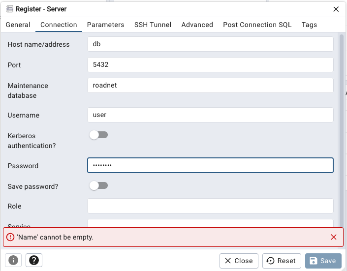

# 🚀 EDGITAL Project

This boilerplate I use in my projects, it provides a separation between API routes, database models, business logic, and startup routines. It uses **Pydantic** for data validation and **SQLAlchemy** for ORM database interaction.

All Logic for the case-study is basically in `geojson_api.py` and `geojson_crud.py`

I also add a `Nextjs` frontend to make testing more pleasant.

---

## 📁 Backend Project Structure

```
.
├── __init__.py                # Project-level init
├── Dockerfile                 # Docker image definition
├── index.py                   # Entry point for FastAPI app
├── pydm/                      # Means Pydantic models (schemas for validation and serialization)
│   └── schemas.py
├── requirements.txt           # Project dependencies
├── routers/                   # API route handlers
│   ├── auth_api.py
│   ├── dependencies.py
│   ├── geojson_api.py
│   └── user_api.py
├── services/                  # Business logic and CRUD operations
│   ├── __init__.py
│   └── geojson_crud.py
├── setup/                     # App startup and initialization utilities
│   ├── __init__.py
│   ├── auth.py
│   ├── setup.py
│   └── wait_for_db.py
├── sqlm/                      # Measn SQLAlchemy models (database tables)
│   ├── __init__.py
│   └── sqlm_tables.py
└── test/                      # Unit and integration tests
    ├── __init__.py
    └── test_geojson_crud.py
```

---

## ⚙️ Setup & Run

### Prerequisites

* Python 3.10+
* Docker (optional, for containerized deployment)
* Postgres with Postgis
* PGAdmin is Optional
* Frontend is Optional


### Install dependencies

In the root directory run:

```bash
docker-compose up --build
```

---

### First Steps
* Backend served in `http://localhost:8000/docs#/`
* Frontend served in `http://localhost` (NGINX maps the locations)
* Create new Users/Customers with `/api/auth/register` endpoint
* Then Login with `/api/auth/login`
* All endpoints are `protected` besided this two
* Frontend available in `http://localhost`

## 🛠️ Approachs**

### ✅ Tasks Implemented

| Task       | Description                                                        |
| ---------- | ------------------------------------------------------------------ |
| **Task 1** | Upload two GeoJSON networks and store in PostGIS with customer ID. |
| **Task 2** | Allow versioned update of network (mark old as `current=False`).   |
| **Task 3** | Retrieve network as GeoJSON, with time-based query filter.         |

### ✅ Points that I used help from AI

Since I was not familiar with GeoAlchemy2 and Geometry overall:

* Used `GeoAlchemy2` for spatial fields.
* Used `shapely` and `geoalchemy2.shape.from_shape()` to convert geometry.
* README


### 🔥 Challenges Encountered

| Problem                          | Fix                                                                     |
| -------------------------------- | ----------------------------------------------------------------------- |
| `from_shape()` failing silently  | Used `print()` + `await db.flush()` to verify inserts                   |
| Lenght and Widgth sometimes were string or lists like: `['2','3']` | Passed a list instead of a string; fixed by extracting correct property |

---


## 🧪 Testing

To run tests:

```bash
pytest
```

---

## Pictures


# DB and PGADMIN access
- PGADMIN_DEFAULT_EMAIL: admin@example.com
- PGADMIN_DEFAULT_PASSWORD: admin
- POSTGRES_DB: roadnet
- POSTGRES_USER: user
- POSTGRES_PASSWORD: password




# Backend_task_02

## Deutsch 

Die Aufgabe setzt sich aus drei Teilaufgaben zusammen, die alle bearbeitet werden müssen. Ziel ist die Erstellung einer einfachen Rest-API zur Verwaltung von Straßennetzen. Zur Aufgabenbearbeitung befinden sich hierzu beigefügt drei Beispiel-Straßennetze (Knoten-Kanten-Modelle) im GeoJSON-Format.

### Aufgabe 1

Die ersten beiden Straßennetze sollen über einen Endpunkt hochgeladen und in einer PostgreSQL Datenbank gespeichert werden können. Da die Straßennetze im Wesentlichen aus Geometrien bestehen, ist die Nutzung einer Geo-Erweiterung wie PostGIS zu empfehlen, um die Daten effizient speichern zu können. Da die Straßennetze zu unterschiedlichen Kunden gehören müssen Sie über ein entsprechendes Attribut verfügen, um eine einfache Authorisierung zu ermöglichen.

### Aufgabe 2

Das dritte Straßennetz stellt eine aktualisierte Version des zweiten Netzes dar. Über einen weiteren Endpunkt soll es möglich sein, ein Update durchzuführen indem die aktualisierte Version des Netzes hochgeladen wird. Bei einem Update sollen die ursprünglichen Kanten nicht gelöscht werden, sondern nur als nicht aktuell gekennzeichnet werden.

### Aufgabe 3

Die Kanten der Straßennetze sollen über einen weiteren Endpunkt im GeoJSON Format abgerufen werden können. Der Endpunkt soll nur die Kanten des angegebenen Netzes eines jeweils authentifizierten Kunden zurückgeben. Über einen Parameter soll zudem angegeben werden können, welchem Zeitpunkt das Netz entsprechen soll. D.h. Netz 2 soll in seinem Zustand vor und nach Update abgerufen werden können.

### Vorgaben

1. Als API-Framework soll Flask oder FastAPI zu verwenden, während die Datenbank mittels Postgres zu realisieren ist.
2. Eine README.md soll die Anwendung sowie die Herangehensweise an die Aufgabenstellung dokumentieren.
3. Die Lösung muss zwingend containerisiert und mittels Docker-Compose einfach ausführbar sein.

## English

The task is made up of three subtasks, all of which must be completed. The aim is to create a simple Rest API for managing road networks. Three example road networks (node-edge models) in GeoJSON format are attached for processing the task.

### Task 1

The first two road networks should be uploaded via an endpoint and stored in a PostgreSQL database. Since the road networks essentially consist of geometries, the use of a geo-extension such as PostGIS is recommended in order to store the data efficiently. As the road networks belong to different customers, they must have a corresponding attribute to enable simple authorization.

### Task 2

The third road network is an updated version of the second network. It should be possible to perform an update via another endpoint by uploading the updated version of the network. During an update, the original edges should not be deleted, but only marked as not up-to-date.

### Task 3

The edges of the road networks should be retrievable via an additional endpoint in GeoJSON format. The endpoint should only return the edges of the specified network of an authenticated customer. It should also be possible to use a parameter to specify which point in time the network should correspond to, i.e. network 2 should be able to be retrieved in its state before and after the update.

### Specifications

1. The API framework to be used should be Flask or FastAPI, while the database is to be realized using Postgres.
2. A README.md should document the application and the approach to the task.
3. The solution must be containerized and readily executable using Docker-Compose.
